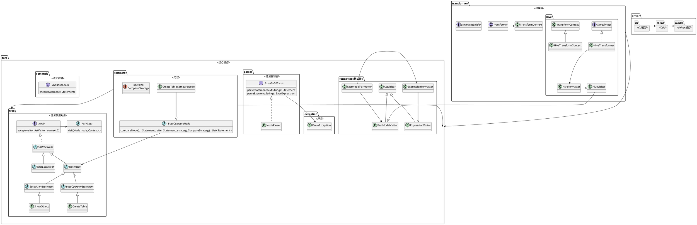
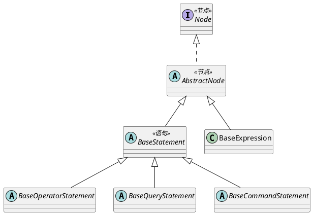

## FML包结构

```plantuml
@startuml
package core <<核心模型>>{

   package tree <<语法模型对象>>{
        interface Node  {
            accept(visitor:AstVisitor, context:C)
        }


        abstract AbstractNode implements Node


        abstract class AstVisitor {
              visit(Node node, Context c)
        }

        Node -> AstVisitor


        abstract class Statement extends AbstractNode

        abstract class BaseExpression extends AbstractNode


        abstract class BaseQueryStatement extends Statement

        abstract class BaseOperatorStatement extends Statement

        class CreateTable extends BaseOperatorStatement

        class ShowObject extends BaseQueryStatement

   }


   package parser <<语法解析器>>{

        interface FastModelParser {
            parseStatement(text:String) : Statement
            parseExpr(text:String) : BaseExpression
        }

        class NodeParser implements FastModelParser


   }


   package exception <<异常>> {

        class ParseException

   }

  FastModelParser --> ParseException


   package compare <<比较>>{
        abstract class BaseCompareNode {
            compareNode(b : Statement , after:Statement, strategy:CompareStrategy) : List<Statement>
        }


        class CreateTableCompareNode


        CreateTableCompareNode --|> BaseCompareNode

        enum CompareStrategy <<比对策略>>

        BaseCompareNode -> Statement
   }


   package formatter<<格式器>>{

        class ExpressionFormatter

        class FastModelFormatter

        class FastModelVisitor extends AstVisitor

        class ExpressionVisitor extends AstVisitor


        ExpressionFormatter --> ExpressionVisitor

        FastModelFormatter --> FastModelVisitor

        FastModelFormatter -> ExpressionFormatter
   }


   package semantic <<语义检查>>{
       interface SemanticCheck {
            check(statement : Statement)
       }

   }
    compare --> tree

}


package driver {
    package cli <<CLI程序>>{
    }

    package client <<JDBC>>{

    }

    package model <<Driver模型>> {
    }

    cli -> client
    client -> model

}


package transformer <<转换器>> {


      interface Transformer {
      }
      class TransformContext {
      }

      interface StatementBuilder

      Transformer -> TransformContext


    package hive{
         class HiveTransformer implements Transformer
         class HiveTransformContext extends TransformContext
         class HiveVisitor
         class HiveFormatter
         HiveVisitor --|> FastModelVisitor
         HiveTransformer --> HiveFormatter
         HiveFormatter -> HiveVisitor
    }
}


transformer --> core
compare --> core
@enduml
```

## FML核心对象

```plantuml
@startuml

interface Node <<节点>>

abstract class AbstractNode <<节点>> implements Node

abstract class BaseStatement <<语句>> extends AbstractNode


abstract class BaseOperatorStatement extends BaseStatement 

abstract class BaseQueryStatement extends BaseStatement 

abstract class BaseCommandStatement extends BaseStatement


class BaseExpression extends AbstractNode

@enduml
```