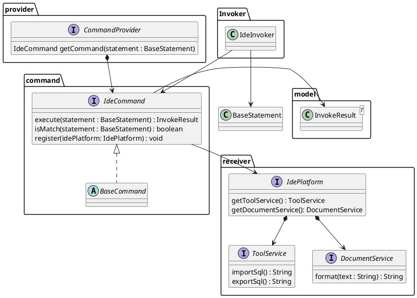
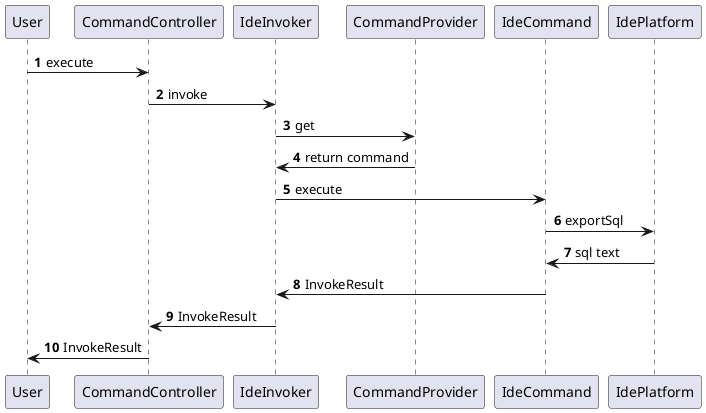

## 概述

为了让用户方便的使用FML来进行建模， 目前提供了简易的IDE方式可以支持用户使用。这块代码主要在fastmodel-ide的maven项目中。

## 使用

```maven
 cd fastmodel-ide-open
 mvn install -Dmaven.test.skip
```

执行后，可以在target中找到对应的jar包， 可以使用命令：

```shell
java -jar fastmodel-ide-open.jar
```

访问：[http://localhost:7001/x6](http://localhost:7001/x6)

## 架构图

### 分层设计

IDE的设计是以FML来进行驱动IDE运作的方式，未来每增加一个命令，都需要增加FML语法规则来支持。 中间采取CQRS的架构进行定制。底层是依赖统一的DomainService服务拆分。

概念名称：

- CommandStatement： 命令语句，FML的命令语句模型表达。
- Command ： CQRS的Command服务，用于执行FML命令的方法的，他的入参是Params
- Params： CommandStatement转换后的对象.
- Invoker：用于管理Command的入口类，根据CommandStatement进行路由处理.
- Provider : 提供了Command的服务类，用于初始化和获取Command的类



## 转换执行图



## 扩展-Extension

默认的SPI提供了以下接口的扩展处理：

- IdePlatform
- ToolService
- DocumentService
- Command
- CommandProvider

默认的扩展可以参考：

- com.aliyun.fastmodel.ide.open.extension.OpenIdePlatform
- com.aliyun.fastmodel.ide.open.extension.OpenIdeCommandProvider

扩展之后，可以使用Configuration定义Invoker入口类

```text
    @Bean
    public IdeInvoker ideInvoker(@Autowired CommandProvider commandProvider) {
        return new DefaultIdeInvoker(commandProvider);
    }
```

## 支持的命令行

| 命令        | 说明                  |
|-----------|---------------------|
| ImportSql | 从其他方言导入SQL，再转为FML模型 | 
| ExportSql | 将FML模型导出为指定的方言的内容   | 
| Render    | 将FML模型进行可视化展示       | 
| Format    | 将FML模型代码进行格式化展示     | 

### ImportSQL

#### 语法结构内容

```text
IMPORT_SQL -m <dialect> [-t <text> | -u <uri>] [WITH <properties>]
```

#### 参数说明

- dialect ： 方言名称，支持方言请看方言支持。
- text： 导入的方言的SQL内容
- uri： 除了支持文本的导入，还支持从uri导入方言的sql文本，可以是oss，远程文件等
- properties： 属性内容

### ExportSQL

#### 语法结构内容

```text
EXPORT_SQL -m <dialect> [-t <text> | -u <uri>] [WITH <properties>]
```

#### 参数说明

- dialect ： 方言名称，支持方言请看方言支持。
- text： 导出的方言的SQL内容
- uri： 除了支持文本的导入，还支持从uri导出fml文本内容，可以是oss，远程文件等
- properties： 属性内容

## 标准协议

## 引用资料

- https://www.bezkoder.com/spring-boot-file-upload/
- https://dev.to/faddalibrahim/how-to-create-a-custom-file-upload-button-using-html-css-and-javascript-1c03
- https://developer.mozilla.org/en-US/docs/Web/API/File/Using_files_from_web_applications