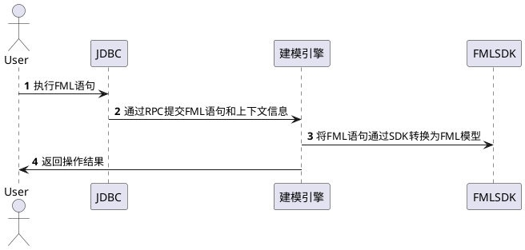

# JDBC 

FML提供了Driver支持通过JDBC Driver的方式来进行连接使用，主要使用的过程如下： 



# 使用方式

## maven引用 

```xml
     <dependency>
                    <groupId>com.aliyun.fastmodel</groupId>
                    <artifactId>fastmodel-driver-client</artifactId>
                    <version>${最新版本}</version>
    </dependency>
```


## Demo 

```java
     String url = "jdbc:fastmodel://localhost:8082/jdbc";
    
     static {
            try {
                Class.forName("com.aliyun.fastmodel.driver.client.FastModelEngineDriver");
            } catch (ClassNotFoundException e) {
                //throw e
            }
        }
    
        @Test
        public void testConnection() throws SQLException {
            Properties properties = getProperties();
            Connection connection = DriverManager.getConnection(url, properties);
            Statement statement = connection.createStatement();
            ResultSet resultSet = statement.executeQuery("show tables;");
            assertTrue(resultSet.next());
            String string = resultSet.getString(1);
            assertEquals(string, "abc");
            assertFalse(resultSet.next());
            connection.close();
        }
```