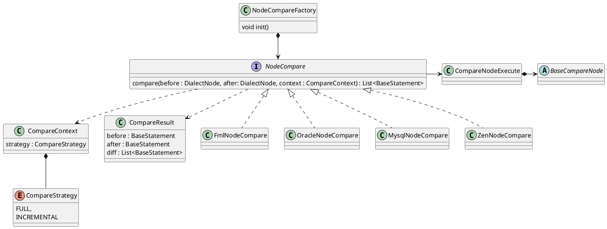
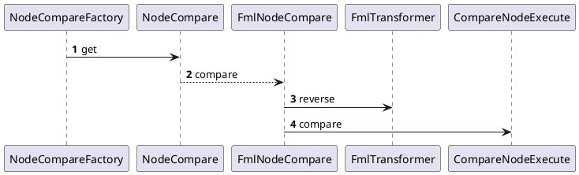

## 概述
在基于transformer的架构体系后，我们可以针对方言脚本的比对处理。 fastmodel-compare包提供了比对内核操作。
你可以基于transformer做比对的能力。 

## 架构图

```plantuml
@startuml
'https://plantuml.com/class-diagram

interface NodeCompare {
    compare(before : DialectNode, after: DialectNode, context : CompareContext) : List<BaseStatement>
}

class NodeCompareFactory {
    void init()
}

enum CompareStrategy  {
    FULL,
    INCREMENTAL
}


class CompareContext {
    strategy : CompareStrategy
}

CompareContext *-- CompareStrategy


class CompareResult {
    before : BaseStatement
    after : BaseStatement
    diff : List<BaseStatement>
}

class FmlNodeCompare implements NodeCompare

class OracleNodeCompare implements NodeCompare

class MysqlNodeCompare implements NodeCompare

class ZenNodeCompare implements NodeCompare

NodeCompareFactory *--> NodeCompare

NodeCompare ..> CompareContext
NodeCompare ..> CompareResult

NodeCompare -> CompareNodeExecute

class CompareNodeExecute {
}

abstract class BaseCompareNode

CompareNodeExecute *-> BaseCompareNode
@enduml
```

## 执行流程图

```plantuml
@startuml
autonumber

NodeCompareFactory -> NodeCompare: get
NodeCompare --> FmlNodeCompare: compare
FmlNodeCompare -> FmlTransformer : reverse
FmlNodeCompare -> CompareNodeExecute : compare

@enduml
```
