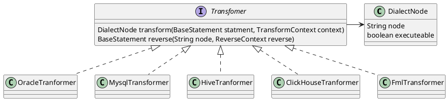

## 目标

支持和扩展不同引擎之间语法转换，当前主要只是大部分的DDL的语法转换处理。

## 方言支持列表

| 方言         | 方言->FML | FML->方言 |
|------------|---------|---------|
| MaxCompute | OK      | OK      |
| Hive       | OK      | OK      |
| Hologres   | NOT     | OK      |
| Mysql      | OK      | OK      |
| Oracle     | OK      | OK      |

## Dialect定义

具体可以参考：com.aliyun.fastmodel.transform.api.dialect.DialectName

## Maven依赖

```xml

<project>
    <dependencyManagement>
        <dependencies>
            <dependency>
                <groupId>com.aliyun.fastmodel</groupId>
                <artifactId>fastmodel-bom</artifactId>
                <version>${lastest}</version>
                <type>pom</type>
                <scope>import</scope>
            </dependency>
        </dependencies>
    </dependencyManagement>

    <dependencies>
        <dependency>
            <groupId>com.aliyun.fastmodel</groupId>
            <artifactId>fastmodel-transform-api</artifactId>
        </dependency>

        <!--支持MaxCompute转换, 未开源
        <dependency>
            <groupId>com.aliyun.fastmodel</groupId>
            <artifactId>fastmodel-transform-maxcompute</artifactId>
        </dependency>-->

        <!--支持hive转换-->
        <dependency>
            <groupId>com.aliyun.fastmodel</groupId>
            <artifactId>fastmodel-transform-hive</artifactId>
        </dependency>

        <!--支持mysql转换-->
        <dependency>
            <groupId>com.aliyun.fastmodel</groupId>
            <artifactId>fastmodel-transform-mysql</artifactId>
        </dependency>

        <!--支持hologres转换-->
        <dependency>
            <groupId>com.aliyun.fastmodel</groupId>
            <artifactId>fastmodel-transform-hologres</artifactId>
        </dependency>


    </dependencies>
</project>

```

## APi调用

```java
//MaxCompute创建转为Mysql 
public class MaxComputeTransformerTest {
    public static void main(String[] args) {
        TransformerFactory transformFactory = TransformerFactory.getInstance();
        Transformer transformer = transformFactory.get(DialectMeta.DEFAULT_MAXCOMPUTE);
        DialectNode dialectNode = new DialectNode("create table a (test bigint) comment 'test';");
        Node baseStatement = transformer.reverse(dialectNode);
        Transformer mysqlTransformer = transformFactory.get(DialectMeta.DEFAULT_MYSQL);
        DialectNode mysqlNode = mysqlTransformer.transform(baseStatement);
        System.out.println(mysqlNode.toString());
    }
}
```

## 设计

1. Transform支持按照SPI的方式进行处理，底层是API提供统一标准和规范。
2. Transform提供：transform-api提供了接口支持， 不同的引擎的实现，是基于transform-api来进行处理。

## 架构图



## 数据类型转换图


## 转换执行图


